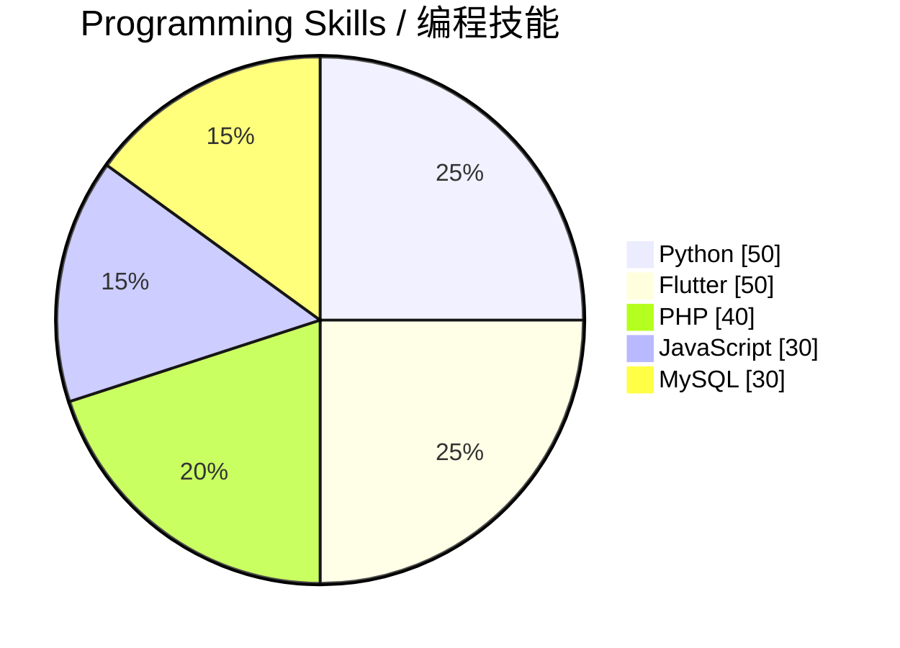
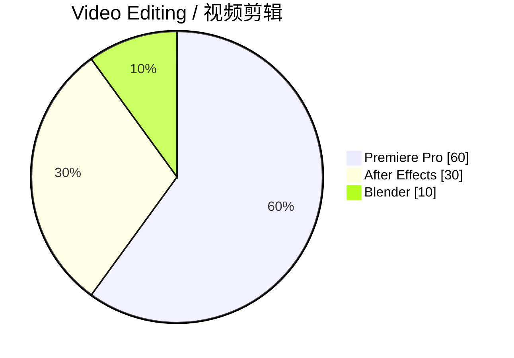
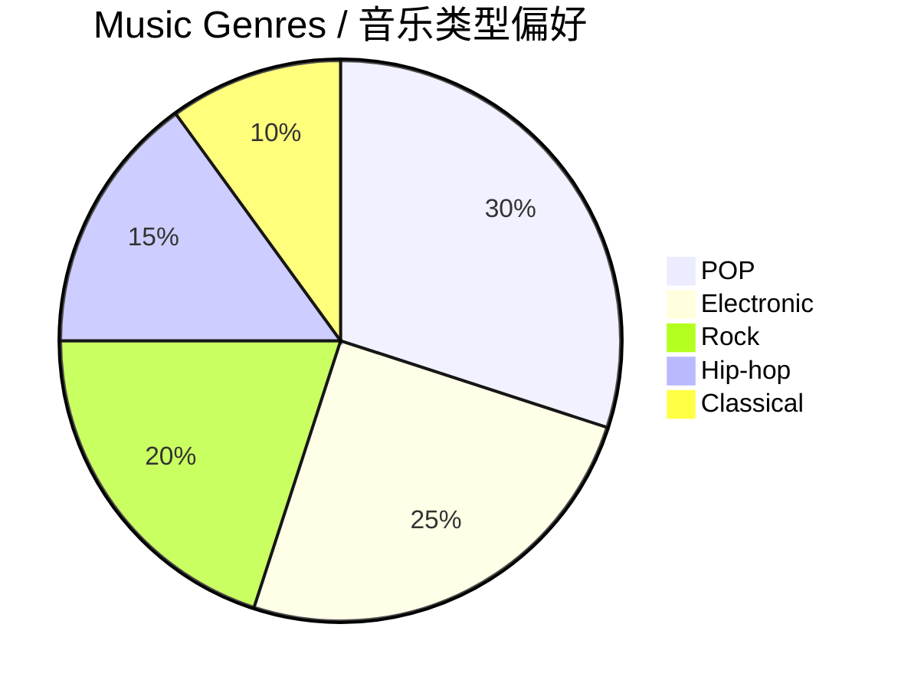
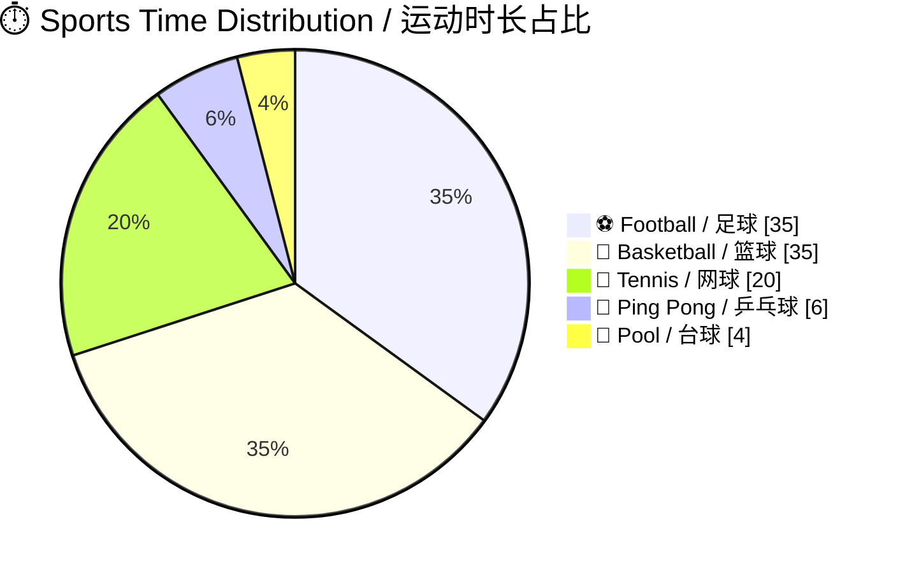

# 👋 Hello, I'm HungryHenry

---

## 📝 About Me / 关于我

>  一个爱写代码👨‍💻、努力把点子变成作品的普通中学生，也喜欢打游戏🎮、听音乐🎵、做运动⚽  
>  A regular middle school student who loves coding 👨‍💻 and turning ideas into projects. Also enjoys gaming 🎮, music 🎵, and sports ⚽.

| Website | Blog | Music |
|-----------|---------|-------------|
| [hungryhenry.cn](https://hungryhenry.cn) | [blog.hungryhenry.cn](https://blog.hungryhenry.cn) | [music.hungryhenry.cn](https://music.hungryhenry.cn) |

---

## 💻 Tech Stack / 技术栈

### Languages & Frameworks / 语言与框架

### Skills Overview / 技能概览

<strong>Skill Details / 技能详情</strong>

| Skill / 技能 | Level / 水平 | Note / 备注 |
|-------------|-----------|-----------|
| **Python** | ⭐⭐⭐⭐⭐ | 主力语言，用于人工智能/脚本 |
| **Flutter** | ⭐⭐⭐⭐ | 跨端开发，目前不打算继续使用了 |
| **JavaScript** | ⭐⭐⭐ | 前后端一锅端，Next.js 个人网站 |
| **PHP** | ⭐⭐⭐ | 旧版网站后端，将迁移至 nodejs |
| **MySQL** | ⭐⭐⭐ | 基础数据库操作 |
| **Premiere Pro** | ⭐⭐⭐⭐⭐ | 视频剪辑主力工具 |
| **After Effects** | ⭐⭐⭐ | 基础动效制作 |
| **Blender** | ⭐ | 3D 入门探索中 |

> 💡 *自我评价仅供参考，持续学习中~ / Self-assessment for reference only, always learning~*

---

## 🎮 Gaming / 游戏时光

<strong>🎮 Currently Playing / 正在游玩</strong>

| Game / 游戏 | Progress / 进度 | Notes / 备注 |
|------------|----------------|-------------|
| 🗡️ **Elden Ring** | ████████░░ 80% | ~55h, 卡在黑剑&女武神，快通关了 |
| 🤠 **RDR2** | ███████░░░ 75% | <60h, 养老式玩法，第三章探索中 |
| 👾 **Among Us** | ██████░░░░ 60% | The Skeld 熟练，其他图待解锁 |
| 🧱 **Minecraft** | ████████░░ 80% | 1.16.5 入坑，原版联机冲全进度 |
| 🚗 **GTAV(OL)** | ░░░░░░░░░░ ❌ | *已弃坑 / Abandoned* |

> 📌 *按入坑顺序从新到旧排序 / Sorted by join date (newest first)*

---

## 🎵 Music / 音乐

### 🎧 Listening / 常听

| Genre / 类型 | Artists / 代表艺人 |
|-------------|-------------------|
| **POP** | 周杰伦, Taylor Swift, Maroon 5, 陈奕迅, MJ... |
| **Electronic** | Avicii, Skrillex, Armin van Buuren, Fred again.. |
| **Rock** | Queen, Led Zeppelin, Coldplay... |
| **Hip-hop** | Eminem, Dr.Dre, 2pac, JAY-Z... |
| **Classical** | Chopin, Rachmaninoff, Vivaldi... |

### 🎹 Playing Piano / 钢琴演奏
>  大概有 6 年没碰钢琴了，最近重新开始弹了 🎹  
>  Haven't touched piano for ~6 years, recently started again!

**Currently Practicing / 近期练习曲目：**
1. Variations in G Major - Beethoven
2. City of Stars - La La Land OST

---

## ⚽ Sports / 运动分布

> 📌 *仅以时长评判，非专业水平 / Based on time spent, not professional level*

---

## 📈 GitHub Stats / GitHub 统计

---

## 🤝 Connect With Me / 联系我

---

## ☕ Support / 支持

>  我的个人网站以及项目完全由我个人开发维护，非盈利。如果对你有帮助，欢迎 [赞助支持](https://hungryhenry.cn/sponsor) 🙏  
>  My website and all the projects are maintained by myself personally and with 0 profit. If you find it helpful, feel free to [support me](https://hungryhenry.cn/sponsor) 🙏

---

*Last updated: 2026*  
*Made with ❤️ by HungryHenry*

